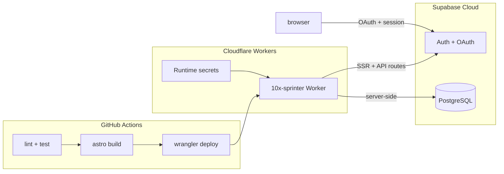

# Deploy Plan — Cloudflare Workers + Supabase

Audit trail for the first production deployment of 10xSprinter. Platform decision: [`context/foundation/infrastructure.md`](../foundation/infrastructure.md). Stack hand-off: [`context/foundation/tech-stack.md`](../foundation/tech-stack.md).

## Platform decision (resolved)

| Source | Says | Resolution |
|--------|------|------------|
| `tech-stack.md` hints | `deployment_target: cloudflare-pages` | **Stale starter hint** — ignore Pages CLI |
| `infrastructure.md` + code | Cloudflare Workers via `@astrojs/cloudflare` v13 | **Authoritative** |
| Deploy command | — | **`npx wrangler deploy`** only — never `pages deploy` |

Worker name: **`10x-sprinter`** (renamed from starter default `10x-astro-starter` in `wrangler.jsonc`).

CI branch: **`master`** (matches existing `.github/workflows/ci.yml`, not `main` from tech-stack hints).

---

## Architecture



**Runtime split:** Workers serve SSR, middleware, and `/api/auth/*` routes. Supabase handles auth sessions and (future) Realtime sync via browser WebSocket — no custom WebSocket server on Workers for MVP.

---

## Phase 0 — Worker configuration

### Agent steps

- [x] Rename Worker in `wrangler.jsonc`: `"name": "10x-sprinter"`
- [x] Optional: add `"account_id"` to `wrangler.jsonc` when Account ID is known (CI can also pass via `CLOUDFLARE_ACCOUNT_ID` secret)

### Human gate

- [x] Confirm Worker name `10x-sprinter` does not collide with an existing Worker on the Cloudflare account — verified 2026-05-22 via `wrangler deployments list` (Worker does not exist yet on account `892de9917c7e1618409949a7ca3bfe3d`)

---

## Phase 1 — Accounts and secrets (manual gates)

### 1.1 Cloudflare

| Step | Owner | Action | Done |
|------|-------|--------|------|
| Account | Human | Create Cloudflare account if missing | [x] |
| Wrangler auth | Human | `npx wrangler login` | [x] |
| Account ID | Human | Dashboard → Workers → copy Account ID | [x] `892de9917c7e1618409949a7ca3bfe3d` (also in `wrangler.jsonc`) |
| API token (CI) | Human | Create token scoped to **Edit Cloudflare Workers** for one account (no DNS, no billing) | [ ] |

**GitHub repository secrets** (Settings → Secrets and variables → Actions):

| Secret | Purpose | Done |
|--------|---------|------|
| `CLOUDFLARE_API_TOKEN` | CI deploy via wrangler-action | [x] |
| `CLOUDFLARE_ACCOUNT_ID` | CI deploy via wrangler-action | [x] |
| `SUPABASE_URL` | CI build (already used by CI) | [x] |
| `SUPABASE_KEY` | CI build — **anon key only**, not service role | [x] |

> **Note:** `wrangler secret list` / `wrangler secret put` require the Worker to exist — runtime secrets are applied **after** the first `wrangler deploy` (Phase 3), then redeploy. GitHub secrets can be configured now.

### 1.2 Supabase Cloud

Production requires a hosted Supabase project (local `supabase start` is dev-only).

| Step | Owner | Action | Done |
|------|-------|--------|------|
| New project | Human | supabase.com → New project | [x] `glxcahnzdoilkgxygfug` |
| API keys | Human | Settings → API → copy Project URL + `anon` public key | [x] |
| Runtime secrets | Human | `npx wrangler secret put SUPABASE_URL` | [x] |
| Runtime secrets | Human | `npx wrangler secret put SUPABASE_KEY` | [x] |
| Google OAuth | Human | Google Cloud Console → OAuth client (Web); authorized redirect: `https://glxcahnzdoilkgxygfug.supabase.co/auth/v1/callback` | [ ] |
| Google provider | Human | [Supabase Google provider](https://supabase.com/dashboard/project/glxcahnzdoilkgxygfug/auth/providers?provider=Google) → enable, paste Client ID + Secret | [ ] |
| Redirect URLs | Human | Supabase → Authentication → URL Configuration → add `https://10x-sprinter.oskar-slyk.workers.dev/api/auth/callback` | [x] |
| Site URL | Human | Set Site URL to `https://10x-sprinter.oskar-slyk.workers.dev` | [x] |

**Human gate:** first `wrangler secret put` and Supabase Auth configuration require manual approval.

---

## Phase 2 — Pre-deploy verification (agent gate)

Run **before** any production deploy. Validates `workerd` compatibility (not just `astro dev`).

```bash
npm ci
npm run lint
npm run test:coverage
npm run build
npx wrangler dev
```

### Local smoke checklist (`wrangler dev`)

| Test | Expected | Done |
|------|----------|------|
| `GET /` | 200 | [x] |
| `GET /auth/signin` | Sign-in form renders | [x] |
| `POST /api/auth/signup` + signin | Session created (requires Supabase credentials in `.dev.vars`) | [x] signup → `/auth/confirm-email`; signin blocked until email confirmed (hosted Supabase default) |
| `GET /dashboard` without session | Redirect to `/auth/signin` | [x] 302 → `/auth/signin` |
| Google OAuth | Optional until redirect URLs configured | [ ] deferred |

**Stop condition:** If SSR routes return 500 under `wrangler dev`, do not deploy. Debug against [Workers Node compat matrix](https://developers.cloudflare.com/workers/runtime-apis/nodejs/) — `nodejs_compat` is a subset of Node.js.

### Phase 2 results

_Record outcomes here after running the gate._

| Command | Exit | Notes |
|---------|------|-------|
| `npm ci` | 0 | 814 packages |
| `npm run lint` | 0 | clean |
| `npm run test:coverage` | 0 | 1/1 tests; 100% statements/lines |
| `npm run build` | 0 | server build OK (`workerd` adapter) |
| `npx wrangler dev` | 0 | Ready on `http://localhost:8787`; no SSR 500s |

---

## Phase 3 — First production deploy (manual gate)

**Human gate:** first production deploy requires explicit approval ([`infrastructure.md`](../foundation/infrastructure.md) §Approval).

```bash
npm run build
npx wrangler deploy
```

Expected URL: `https://10x-sprinter.<subdomain>.workers.dev`

### Post-deploy (human)

1. Copy exact Worker URL → Supabase Auth redirect URLs (+ Site URL if needed) — [x]
2. Re-test Google OAuth with production callback — [x] authorize URL includes production `/api/auth/callback` (full browser flow pending Google provider config)
3. Record final URL below:

**Production URL:** `https://10x-sprinter.oskar-slyk.workers.dev`

### Production smoke checklist

| Test | Expected | Done |
|------|----------|------|
| `/` | 200, no env values in HTML source | [x] |
| `/auth/signin`, `/auth/signup` | Render OK | [x] |
| Email signup + signin | Session, access to `/dashboard` | [ ] blocked by Supabase email rate limit during automated test; signup flow reachable |
| Google SSO | Redirect → `/api/auth/callback` → `/dashboard` | [x] redirect_to correct; full OAuth needs Google provider enabled in Supabase |
| `/dashboard` without auth | Redirect to sign-in | [x] 302 → `/auth/signin` |
| `npx wrangler tail` | No "Supabase env missing" errors | [x] no errors observed during smoke |

### Rollback

```bash
npx wrangler rollback [VERSION_ID]
```

Static assets roll back with the Worker version. **Supabase migrations do not roll back automatically.**

---

## Phase 4 — CI/CD auto-deploy

File: [`.github/workflows/deploy.yml`](../../.github/workflows/deploy.yml)

- **Trigger:** `push` to `master`
- **Steps:** checkout → Node 22 → `npm ci` → `npm run build` (with `SUPABASE_*`) → `cloudflare/wrangler-action@v3`
- **Runtime secrets:** stored in Cloudflare only — not passed through the workflow
- **Fork PRs:** no deploy (no production secrets on untrusted builds)

### CI verification checklist

| Check | Done |
|-------|------|
| `deploy.yml` committed | [x] merged to `master` via PR #3 |
| GitHub secrets configured (Phase 1) | [x] all four secrets set |
| Push to `master` → Deploy workflow green | [x] run `26308465870` passed in 40s |
| Live URL smoke test after CI deploy | [x] `/` 200, `/auth/signin` 200, `/dashboard` 302 |

---

## Phase 5 — Operations

### Ops baseline (verified 2026-05-22)

| Item | Value |
|------|-------|
| Production URL | https://10x-sprinter.oskar-slyk.workers.dev |
| Current Worker version | `f2aef6f6-f8d4-40ed-afc5-73592b898e26` (CI deploy from `3c94108`) |
| Previous version (rollback target) | `465e2004-66f0-4801-85d9-d4851c6d758a` |
| Runtime secrets | `SUPABASE_URL`, `SUPABASE_KEY` |
| CI deploy workflow | [Deploy run 26308465870](https://github.com/Oskarovsky/Sprinter/actions/runs/26308465870) — success |
| Auto-deploy trigger | push to `master` |

### Logs

- Live: `npx wrangler tail`
- Dashboard: [Cloudflare Workers → 10x-sprinter → Logs](https://dash.cloudflare.com/?to=/:account/workers/services/view/10x-sprinter/production/observability/logs)
- CI: `gh run list --workflow=deploy.yml` or [GitHub Actions](https://github.com/Oskarovsky/Sprinter/actions/workflows/deploy.yml)

### Secret rotation (human-only)

1. Update in Cloudflare: `npx wrangler secret put <NAME>`
2. Redeploy Worker: `npx wrangler deploy` (or push to `master` for CI deploy)
3. Update GitHub repository secrets separately for CI build: `gh secret set <NAME>`

**Runtime secrets (Cloudflare):**

```bash
npx wrangler secret put SUPABASE_URL
npx wrangler secret put SUPABASE_KEY
npx wrangler deploy
```

**CI build secrets (GitHub):**

```bash
gh secret set SUPABASE_URL
gh secret set SUPABASE_KEY
gh secret set CLOUDFLARE_API_TOKEN   # if rotating deploy token
```

### Rollback

```bash
npx wrangler rollback 465e2004-66f0-4801-85d9-d4851c6d758a
```

List versions: `npx wrangler deployments list --name 10x-sprinter`

### Approval matrix

| Action | Owner |
|--------|-------|
| First production deploy | Human — [x] done 2026-05-22 |
| `wrangler secret put` / secret rotation | Human |
| Delete Worker or DNS records | Human |
| Supabase RLS changes on production data | Human |
| `npm run build`, preview Worker deploy, `wrangler tail` | Agent |
| Push to `master` (auto-deploy) | Human (via merge/PR) |

### Phase 5 checklist

| Check | Done |
|-------|------|
| Production URL recorded | [x] |
| Log access documented (`wrangler tail`, dashboard, Actions) | [x] |
| Rollback command + version IDs recorded | [x] |
| Secret rotation procedure documented | [x] |
| Approval matrix acknowledged | [x] |

---

## Risk register

Carried from [`infrastructure.md`](../foundation/infrastructure.md) — apply during deploy and post-deploy monitoring.

| Risk | Source | L | I | Mitigation |
|------|--------|---|---|------------|
| Node-incompatible dependency breaks production SSR | Devil's advocate | M | H | `wrangler dev` gate before every deploy; audit deps against Workers Node compat matrix |
| Free-tier CPU timeout on SSR + AI routes | Devil's advocate | M | M | Workers Paid ($5/mo); keep OpenRouter in dedicated API routes |
| Real-time sync misses ≤3s PRD target | Pre-mortem | M | H | Supabase Realtime channels; no HTTP polling |
| OpenRouter key exposed to client | Pre-mortem | L | H | Astro env schema `access: "secret"`, `context: "server"` only |
| Preview deploy leaks production secrets | Unknown unknowns | L | H | Separate Worker names + secret sets for preview vs prod |
| `wrangler deploy` vs Pages CLI confusion | Unknown unknowns | M | M | Always `npx wrangler deploy` per this plan |
| Supabase Realtime blocked by missing RLS | Unknown unknowns | M | H | RLS policies before Realtime subscriptions |
| Deploy disconnects custom WebSocket clients | Devil's advocate | L | M | Supabase Realtime for MVP; defer custom WS to Durable Objects |

---

## Deferred (out of first deploy scope)

- Preview Workers per PR (separate `--name` + secret set)
- Custom domain + DNS in Cloudflare
- `OPENROUTER_API_KEY` (FR-013–016)
- Supabase Realtime + RLS on session/vote tables
- Workers Paid upgrade ($5/mo) — only if Error 1027 CPU timeout appears
- Update `deployment_target` in `tech-stack.md` frontmatter (documentation drift)

---

## Reference commands

```bash
# Authenticate (human, once)
npx wrangler login

# Set runtime secrets (human)
npx wrangler secret put SUPABASE_URL
npx wrangler secret put SUPABASE_KEY

# Pre-deploy gate (agent)
npm ci && npm run lint && npm run test:coverage && npm run build && npx wrangler dev

# First / manual deploy (human)
npm run build && npx wrangler deploy

# Post-deploy monitoring
npx wrangler tail

# Rollback
npx wrangler rollback [VERSION_ID]
```
