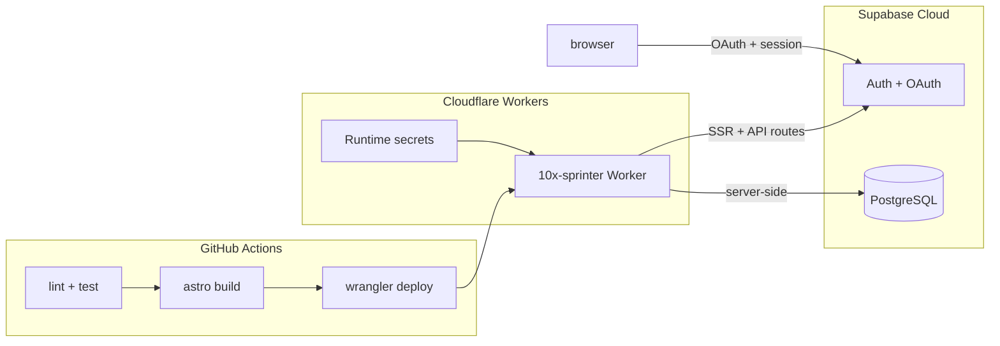

# Deploy Plan — Cloudflare Workers + Supabase

Audit trail for the first production deployment of 10xSprinter. Platform decision: [`context/foundation/infrastructure.md`](../foundation/infrastructure.md). Stack hand-off: [`context/foundation/tech-stack.md`](../foundation/tech-stack.md).

## Platform decision (resolved)

| Source | Says | Resolution |
|--------|------|------------|
| `tech-stack.md` hints | `deployment_target: cloudflare-pages` | **Stale starter hint** — ignore Pages CLI |
| `infrastructure.md` + code | Cloudflare Workers via `@astrojs/cloudflare` v13 | **Authoritative** |
| Deploy command | — | **`npx wrangler deploy`** only — never `pages deploy` |

Worker name: **`10x-sprinter`** (renamed from starter default `10x-astro-starter` in `wrangler.jsonc`).

CI branch: **`master`** (matches existing `.github/workflows/ci.yml`, not `main` from tech-stack hints).

---

## Architecture



**Runtime split:** Workers serve SSR, middleware, and `/api/auth/*` routes. Supabase handles auth sessions and (future) Realtime sync via browser WebSocket — no custom WebSocket server on Workers for MVP.

---

## Phase 0 — Worker configuration

### Agent steps

- [x] Rename Worker in `wrangler.jsonc`: `"name": "10x-sprinter"`
- [ ] Optional: add `"account_id"` to `wrangler.jsonc` when Account ID is known (CI can also pass via `CLOUDFLARE_ACCOUNT_ID` secret)

### Human gate

- [ ] Confirm Worker name `10x-sprinter` does not collide with an existing Worker on the Cloudflare account

---

## Phase 1 — Accounts and secrets (manual gates)

### 1.1 Cloudflare

| Step | Owner | Action | Done |
|------|-------|--------|------|
| Account | Human | Create Cloudflare account if missing | [ ] |
| Wrangler auth | Human | `npx wrangler login` | [ ] |
| Account ID | Human | Dashboard → Workers → copy Account ID | [ ] |
| API token (CI) | Human | Create token scoped to **Edit Cloudflare Workers** for one account (no DNS, no billing) | [ ] |

**GitHub repository secrets** (Settings → Secrets and variables → Actions):

| Secret | Purpose | Done |
|--------|---------|------|
| `CLOUDFLARE_API_TOKEN` | CI deploy via wrangler-action | [ ] |
| `CLOUDFLARE_ACCOUNT_ID` | CI deploy via wrangler-action | [ ] |
| `SUPABASE_URL` | CI build (already used by CI) | [ ] |
| `SUPABASE_KEY` | CI build — **anon key only**, not service role | [ ] |

### 1.2 Supabase Cloud

Production requires a hosted Supabase project (local `supabase start` is dev-only).

| Step | Owner | Action | Done |
|------|-------|--------|------|
| New project | Human | supabase.com → New project | [ ] |
| API keys | Human | Settings → API → copy Project URL + `anon` public key | [ ] |
| Runtime secrets | Human | `npx wrangler secret put SUPABASE_URL` | [ ] |
| Runtime secrets | Human | `npx wrangler secret put SUPABASE_KEY` | [ ] |
| Google OAuth | Human | Google Cloud Console → OAuth client (Web); authorized redirect: `https://<ref>.supabase.co/auth/v1/callback` | [ ] |
| Google provider | Human | Supabase → Authentication → Providers → Google → enable, paste Client ID + Secret | [ ] |
| Redirect URLs | Human | Supabase → Authentication → URL Configuration → add `https://10x-sprinter.<subdomain>.workers.dev/api/auth/callback` (exact URL after first deploy) | [ ] |
| Site URL | Human | Set Site URL to production Worker origin if required by Supabase Auth | [ ] |

**Human gate:** first `wrangler secret put` and Supabase Auth configuration require manual approval.

---

## Phase 2 — Pre-deploy verification (agent gate)

Run **before** any production deploy. Validates `workerd` compatibility (not just `astro dev`).

```bash
npm ci
npm run lint
npm run test:coverage
npm run build
npx wrangler dev
```

### Local smoke checklist (`wrangler dev`)

| Test | Expected | Done |
|------|----------|------|
| `GET /` | 200 | [ ] |
| `GET /auth/signin` | Sign-in form renders | [ ] |
| `POST /api/auth/signup` + signin | Session created (requires Supabase credentials in `.dev.vars`) | [ ] |
| `GET /dashboard` without session | Redirect to `/auth/signin` | [ ] |
| Google OAuth | Optional until redirect URLs configured | [ ] |

**Stop condition:** If SSR routes return 500 under `wrangler dev`, do not deploy. Debug against [Workers Node compat matrix](https://developers.cloudflare.com/workers/runtime-apis/nodejs/) — `nodejs_compat` is a subset of Node.js.

### Phase 2 results

_Record outcomes here after running the gate._

| Command | Exit | Notes |
|---------|------|-------|
| `npm run lint` | | |
| `npm run test:coverage` | | |
| `npm run build` | | |
| `npx wrangler dev` | | |

---

## Phase 3 — First production deploy (manual gate)

**Human gate:** first production deploy requires explicit approval ([`infrastructure.md`](../foundation/infrastructure.md) §Approval).

```bash
npm run build
npx wrangler deploy
```

Expected URL: `https://10x-sprinter.<subdomain>.workers.dev`

### Post-deploy (human)

1. Copy exact Worker URL → Supabase Auth redirect URLs (+ Site URL if needed)
2. Re-test Google OAuth with production callback
3. Record final URL below:

**Production URL:** `________________________________`

### Production smoke checklist

| Test | Expected | Done |
|------|----------|------|
| `/` | 200, no env values in HTML source | [ ] |
| `/auth/signin`, `/auth/signup` | Render OK | [ ] |
| Email signup + signin | Session, access to `/dashboard` | [ ] |
| Google SSO | Redirect → `/api/auth/callback` → `/dashboard` | [ ] |
| `/dashboard` without auth | Redirect to sign-in | [ ] |
| `npx wrangler tail` | No "Supabase env missing" errors | [ ] |

### Rollback

```bash
npx wrangler rollback [VERSION_ID]
```

Static assets roll back with the Worker version. **Supabase migrations do not roll back automatically.**

---

## Phase 4 — CI/CD auto-deploy

File: [`.github/workflows/deploy.yml`](../../.github/workflows/deploy.yml)

- **Trigger:** `push` to `master`
- **Steps:** checkout → Node 22 → `npm ci` → `npm run build` (with `SUPABASE_*`) → `cloudflare/wrangler-action@v3`
- **Runtime secrets:** stored in Cloudflare only — not passed through the workflow
- **Fork PRs:** no deploy (no production secrets on untrusted builds)

### CI verification checklist

| Check | Done |
|-------|------|
| `deploy.yml` committed | [ ] |
| GitHub secrets configured (Phase 1) | [ ] |
| Push to `master` → Deploy workflow green | [ ] |
| Live URL smoke test after CI deploy | [ ] |

---

## Phase 5 — Operations

### Logs

- Live: `npx wrangler tail`
- Dashboard: Cloudflare → Workers → `10x-sprinter` → Logs
- CI: `gh run view` or GitHub Actions UI

### Secret rotation (human-only)

1. Update in Cloudflare: `npx wrangler secret put <NAME>`
2. Redeploy Worker
3. Update GitHub repository secrets separately for CI build

### Approval matrix

| Action | Owner |
|--------|-------|
| First production deploy | Human |
| `wrangler secret put` / secret rotation | Human |
| Delete Worker or DNS records | Human |
| Supabase RLS changes on production data | Human |
| `npm run build`, preview Worker deploy, `wrangler tail` | Agent |

---

## Risk register

Carried from [`infrastructure.md`](../foundation/infrastructure.md) — apply during deploy and post-deploy monitoring.

| Risk | Source | L | I | Mitigation |
|------|--------|---|---|------------|
| Node-incompatible dependency breaks production SSR | Devil's advocate | M | H | `wrangler dev` gate before every deploy; audit deps against Workers Node compat matrix |
| Free-tier CPU timeout on SSR + AI routes | Devil's advocate | M | M | Workers Paid ($5/mo); keep OpenRouter in dedicated API routes |
| Real-time sync misses ≤3s PRD target | Pre-mortem | M | H | Supabase Realtime channels; no HTTP polling |
| OpenRouter key exposed to client | Pre-mortem | L | H | Astro env schema `access: "secret"`, `context: "server"` only |
| Preview deploy leaks production secrets | Unknown unknowns | L | H | Separate Worker names + secret sets for preview vs prod |
| `wrangler deploy` vs Pages CLI confusion | Unknown unknowns | M | M | Always `npx wrangler deploy` per this plan |
| Supabase Realtime blocked by missing RLS | Unknown unknowns | M | H | RLS policies before Realtime subscriptions |
| Deploy disconnects custom WebSocket clients | Devil's advocate | L | M | Supabase Realtime for MVP; defer custom WS to Durable Objects |

---

## Deferred (out of first deploy scope)

- Preview Workers per PR (separate `--name` + secret set)
- Custom domain + DNS in Cloudflare
- `OPENROUTER_API_KEY` (FR-013–016)
- Supabase Realtime + RLS on session/vote tables
- Workers Paid upgrade ($5/mo) — only if Error 1027 CPU timeout appears
- Update `deployment_target` in `tech-stack.md` frontmatter (documentation drift)

---

## Reference commands

```bash
# Authenticate (human, once)
npx wrangler login

# Set runtime secrets (human)
npx wrangler secret put SUPABASE_URL
npx wrangler secret put SUPABASE_KEY

# Pre-deploy gate (agent)
npm ci && npm run lint && npm run test:coverage && npm run build && npx wrangler dev

# First / manual deploy (human)
npm run build && npx wrangler deploy

# Post-deploy monitoring
npx wrangler tail

# Rollback
npx wrangler rollback [VERSION_ID]
```
